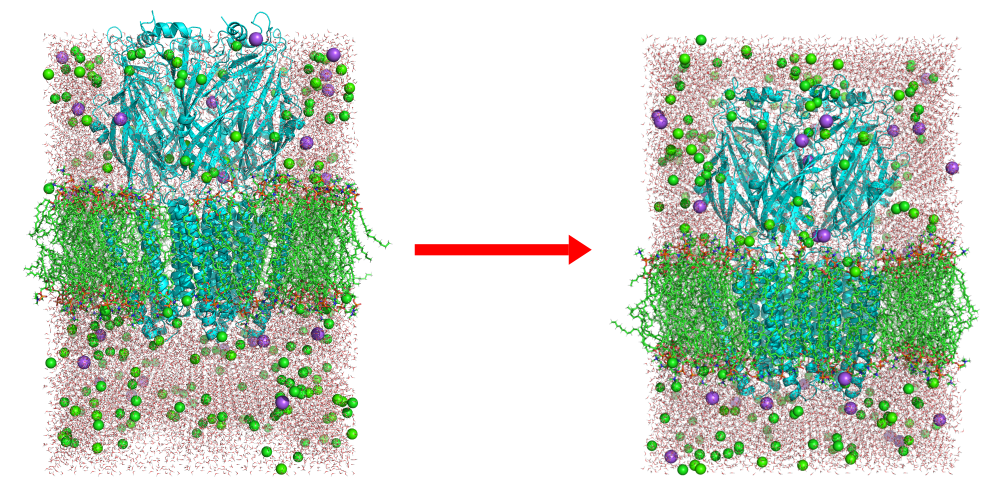

# MD_box_fixer

Solves the annoying issue with proteins not being centered in MD simuation boxes, also allows the user to shift the entire simulation box and calculate PBC vectors

### Usage
1) Download the `shift_solvent.tcl` script
2) Launched VMD and load the MD prepared structure
3) load the script into vmd: `source shift_solvent.tcl`
4) Run the script with the molid as the argument i.e. `shift_solvent top` or `shift_solvent 0`
5) Add to `vmdrc` to have it auto-load on start (optional)
